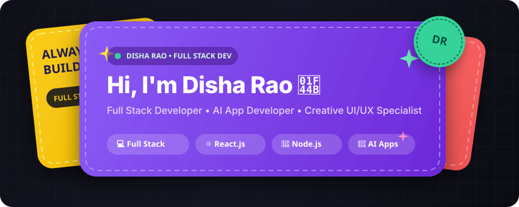
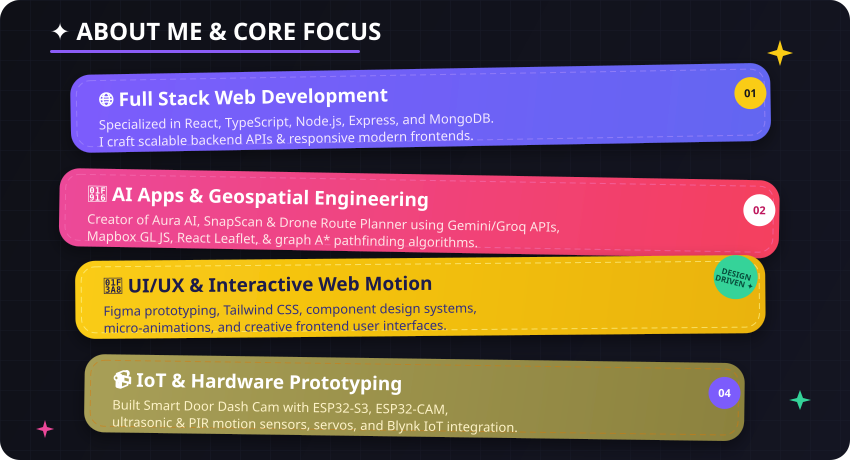
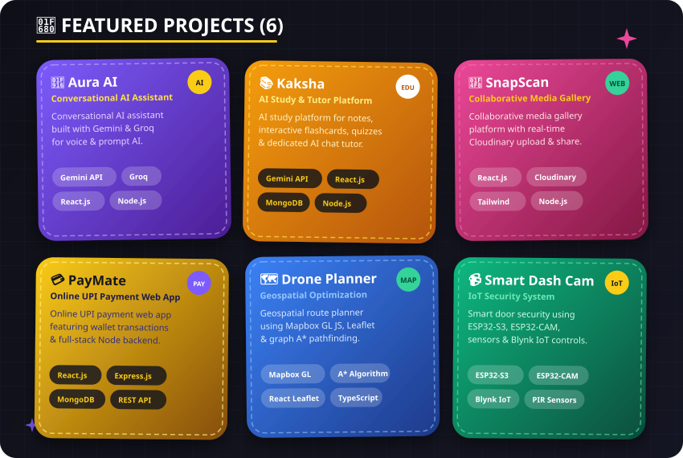
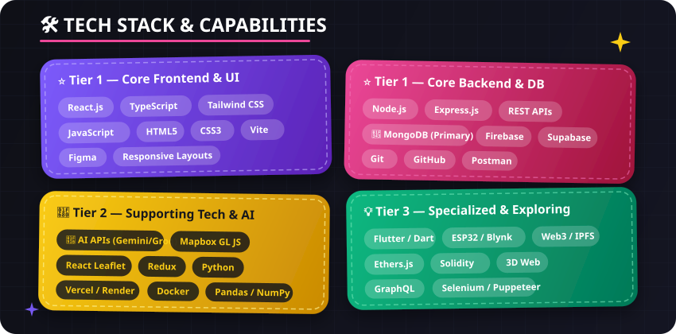
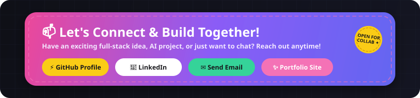

<!-- HERO BANNER -->

 

<!-- QUICK BADGES & PROFILE VIEWS -->

  
  
  
  
  
  
  
  

 

---

### ✦ ABOUT ME & CORE FOCUS

  

 

---

### 🚀 FEATURED PROJECTS

  

 

<b>🔗 Live Demos & Project Directory (6 Flagships)</b>

 

| Project | Category | Live Demo / Repo | Description & Key Tech Stack |
| :--- | :--- | :--- | :--- |
| 🤖 **Aura AI Assistant** | AI Applications | [🚀 Live Demo](https://aura-lilac-xi-14.vercel.app/) | Voice & prompt AI assistant built with `Gemini API`, `Groq`, `React.js` & `Node.js`. |
| 📚 **Kaksha AI** | EdTech / AI | `AI Study Web App` | AI-powered learning platform: structured notes, flashcards, quizzes & AI chat tutor (`Gemini API`, `React`, `MongoDB`). |
| 📸 **SnapScan Gallery** | Collaborative Web | [🚀 Live Demo](https://snapscan-kappa.vercel.app/) | Collaborative media gallery with real-time `Cloudinary` upload & `React` frontend. |
| 💳 **PayMate UPI** | FinTech / Web | [🚀 Live Demo](https://paymate-vercel.vercel.app/) | Online UPI payment platform featuring wallet transactions (`React`, `Express`, `MongoDB`). |
| 🗺️ **Drone Route Planner** | Geospatial Web | `Interactive App` | Route optimization platform featuring `Mapbox GL JS`, `React Leaflet` & `A* Pathfinding`. |
| 📹 **Smart Door Dash Cam** | IoT & Hardware | `Embedded System` | Smart door security camera system with `ESP32-S3`, `ESP32-CAM`, PIR sensors & `Blynk IoT`. |

 

---

### 🛠️ TECH STACK & CAPABILITIES

  

 

#### ⭐ Tier 1 — Core Stack (Primary Focus)
* **Frontend**: HTML5, CSS3, JavaScript (ES6+), TypeScript, React.js, Tailwind CSS, Vite
* **Backend**: Node.js, Express.js, RESTful API Development, Middleware, Server Logic
* **Databases**: MongoDB (Aggregation `$sort`, `$count`, `mongodump`), Firebase (Hosting/Emulator), Supabase
* **Design**: Figma, UI/UX Prototyping, Responsive Web Design, Component Architecture
* **Developer Tools**: Git, GitHub, VS Code, Postman, npm, npx, Terminal / CLI

#### 🚀 Tier 2 — Strong Supporting Skills
* **State & Libraries**: Redux, Mapbox GL JS, React Leaflet, Cloudinary
* **Cloud & Deployment**: Vercel, Render, Railway, Netlify, Cloudflare, Docker
* **AI & Data**: AI API Integration (Gemini API, Groq, OpenAI), Python, Pandas, NumPy, Matplotlib
* **Mobile & Creative**: Flutter & Dart (Mobile UI), WebGL & 3D Web Concepts

#### 💡 Tier 3 — Specialized & Exploring
* **Web3 / Blockchain**: Ethers.js, Web3.js, IPFS, Solidity (Learning)
* **Testing & Automation**: Selenium, Puppeteer
* **Hardware / IoT**: ESP32-S3, ESP32-CAM, Sensors, Blynk IoT Framework
* **Others Studied**: GraphQL, C, C++, Java, MySQL, PostgreSQL, Power BI

 

---

### 📊 GITHUB STATS & STREAK

  <table border="0" style="border: none;">
    <tr>
      <td>
        
      </td>
      <td>
        
      </td>
    </tr>
  </table>
  
   

  

 

---

### 📫 LET'S CONNECT & BUILD TOGETHER

  

    

  <!-- OFFICIAL SOCIAL LINKS -->
  
  &nbsp;
  
  &nbsp;
  
  &nbsp;
  

 

  Designed with 💜 & ✨ for <b>@dishaaarao</b>

